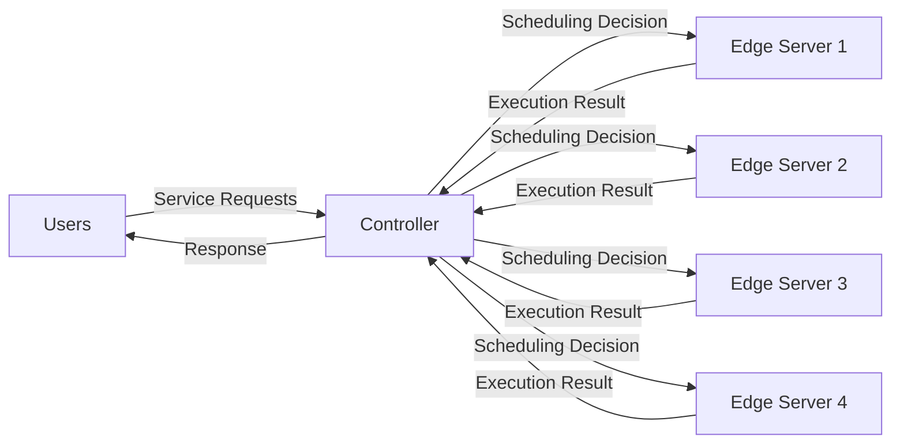
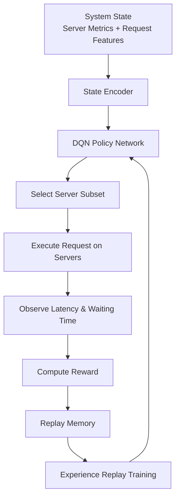

# SafeTail 2.0


SafeTail 2.0 is an **intelligent workload scheduling framework for heterogeneous edge computing environments** that uses **Reinforcement Learning (RL)** to dynamically allocate service requests across edge servers.

This repository extends the **SafeTail 1.0 framework** by introducing a **Deep Reinforcement Learning–based controller** that learns optimal scheduling strategies based on system state, workload characteristics, and queue delays.

The system is designed for **latency-sensitive applications deployed on heterogeneous edge devices**.

---

# Relationship with [SafeTail 1.0](https://arxiv.org/html/2408.17171v1)

SafeTail 2.0 is a **continuation of SafeTail 1.0** with major improvements in scheduling intelligence and system modeling.

Key improvements include:

* Reinforcement learning–based scheduling
* Latency prediction models
* Dynamic workload balancing
* Queueing-theory based delay estimation
* Episodic reward optimization
* Extensive training analytics

---

# System Architecture

The SafeTail system consists of **three main components**:

* Users
* Controller
* Edge Servers



### Users

Users submit service requests containing:

* input parameters
* service characteristics
* network conditions
* workload metadata

### Controller

The **controller acts as the central scheduler**.

It:

* receives incoming requests
* monitors edge server states
* predicts processing delays
* assigns tasks using an RL policy
* tracks latency and satisfaction metrics

The controller observes both **static and dynamic system state**, including:

Static features:

* CPU speed
* RAM
* GPU speed
* GPU memory
* number of CPU cores

Dynamic features:

* CPU utilization
* GPU utilization
* memory utilization
* queue length
* active workload

These heterogeneous server states are encoded into a unified representation before being fed into the RL model. 

---

# Reinforcement Learning Scheduling

SafeTail 2.0 uses a **Deep Q-Network (DQN)** to learn optimal server allocation strategies.

The RL agent observes system state and outputs **subsets of servers** that should execute the request.

Multiple servers may process the same request **redundantly** to minimize latency.

### RL Decision Flow



The neural architecture includes:

* **state encoder layers**
* **global pooling**
* **fully connected Q-network**

The encoder converts variable-length state information into a fixed-dimension embedding before action prediction. 

---

# Training Structure

Training uses a **step-based and episodic reinforcement learning loop**.

### Step

Each **step corresponds to processing one request**.

The controller:

1. observes system state
2. predicts server processing delays
3. selects servers using the RL policy
4. schedules execution
5. computes step reward

---

### Episode

An **episode consists of multiple steps**.

After each episode:

* episodic reward is computed
* experiences are added to replay memory
* the DQN model is trained

---

# Reward Mechanism

SafeTail uses **two reward levels**.

## Step Reward

Encourages **efficient resource utilization**.

The reward considers:

* RAM utilization
* CPU utilization
* GPU utilization
* GPU memory usage

Higher reward is given to servers with **lower resource contention**.

---

## Episodic Reward

The episodic reward optimizes long-term system performance.

It includes:

* discounted step rewards
* request satisfaction score
* average waiting time

The degree of satisfaction depends on whether a request finishes within **soft and hard deadline thresholds**. 

---

# Queueing Model

The controller queue is modeled as an **M/M/1 queue**.

This allows estimation of waiting time:

[
W = \frac{\lambda}{\mu(\mu - \lambda)}
]

Where:

* λ = arrival rate
* μ = service rate

This queue model helps estimate scheduling delays under dynamic workloads. 

---

# Latency Modeling

Computation latency is predicted using **MLP regression models** trained on experimental system traces.

These models consider:

* application characteristics
* input size
* CPU and GPU utilization
* memory consumption

This enables the controller to **predict execution delay before scheduling tasks**. 

---

# Repository Structure

```
SafeTail-2.0
│
├── controller.py
│   RL scheduling controller
│
├── agent.py
│   Deep Q-Network agent implementation
│
├── servers.py
│   Edge server simulation
│
├── user.py
│   Request modeling
│
├── constants.py
│   System configuration
│
├── training_logs
│   Training metrics and plots
│
└── datasets / utilities
```

The controller coordinates scheduling, training, and system monitoring. 

---

# Training Metrics

During training the system records:

* training loss
* validation loss
* reward progression
* server access rate
* latency statistics
* exploration vs exploitation
* model prediction time

Plots and metrics are automatically generated during training.

---

# Example Training Visualizations

The framework produces plots such as:

* loss curves
* latency distribution
* reward trends
* exploration decay
* server utilization patterns

These are stored in the **training logs directory**.

---

# Use Cases

SafeTail is designed for **latency-sensitive edge workloads**, including:

* computer vision inference
* speech recognition
* IoT analytics
* AR / VR processing
* real-time ML inference pipelines

---

# Contributors

* [**Shrutya Chawla**](https://github.com/shrutya22487/)
* [**Shamik Sinha**](https://github.com/theshamiksinha)
* [**Shivankar Singh**](https://github.com/BingoBoy479)
* [**Jyoti Shokhanda**](https://github.com/Jyotishokhanda)
* [**Arani Bhattacharya**](https://github.com/arani89)

